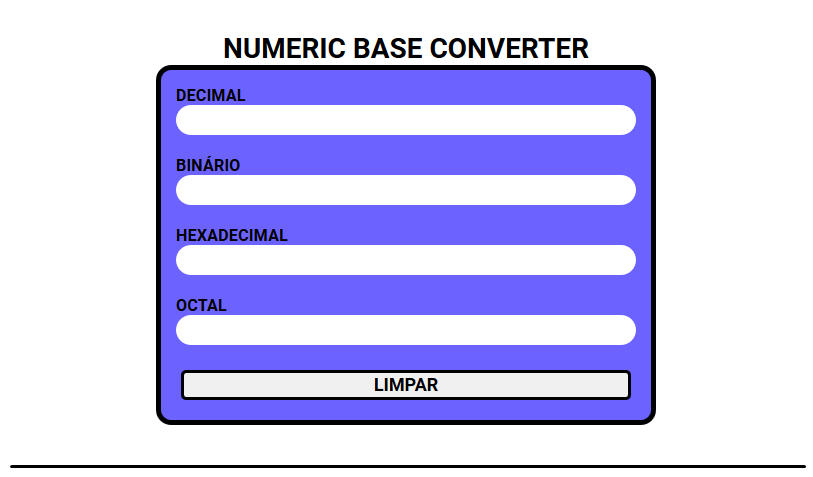

<h1 align="center">Numeric base converter</h1>

<h2 align="center">O coversor de base decimal recebe um número decimal e converte em binário, octal e hexadecimal</h2>

<strong><a href="https://caiohenriquemachado.github.io/QuizViperX-project/">ACESSAR SITE</a></strong>

  

 
  
 
 
  <h2 align="center">FEATURES :book:</h2>
 

- 📄 **HTML5** 		  - Para construir a estrutura do site.
- ⚛️ **CSS3** 	    - Para a estilização e personalização das estruturas no site.
- 📊 **JavaScript** - Para inserir a lógica do Quiz.

 
<h2 align="center">License</h2>

This project is licensed under the MIT License - see the [LICENSE](https://opensource.org/licenses/MIT) page for details.
